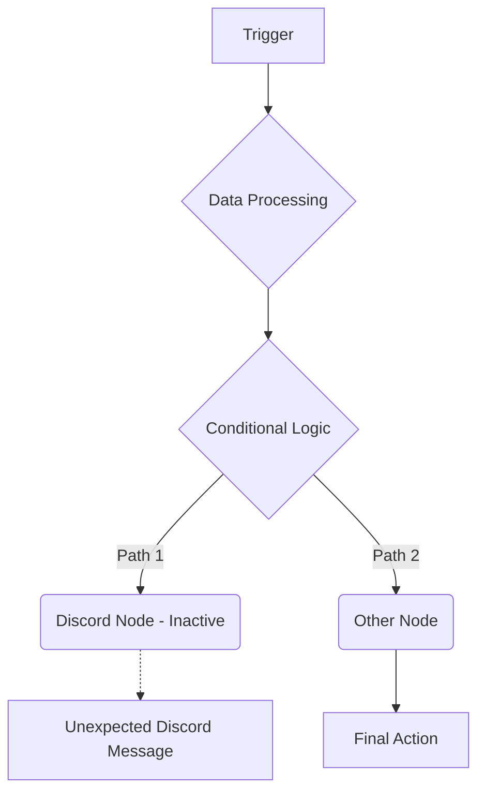

### Context
n8n 워크플로우에서 디스코드 메시지를 보내는 노드를 비활성화(끊어 놓음)했음에도 불구하고 여전히 메시지가 발송되는 현상에 대한 원인 분석 및 해결 방안 모색.

### Core
1.  **워크플로우의 다른 경로 확인**: 비활성화된 디스코드 노드 외에, 워크플로우 내 다른 활성화된 노드나 분기 로직을 통해 데이터가 디스코드 노드로 전달되는지 확인합니다. n8n은 복잡한 데이터 흐름을 가질 수 있으므로, 예상치 못한 경로를 추적해야 합니다.
2.  **캐시된 데이터 확인**: 이전 워크플로우 실행 시 저장된 캐시 데이터가 비활성화된 노드를 우회하여 디스코드 노드를 트리거할 수 있습니다. 워크플로우 실행 시 캐시 설정을 확인하거나, 캐시를 삭제 후 재시도합니다.
3.  **노드 상태 재점검**: '끊어 놓았다'는 것이 노드 자체를 비활성화(deactivate)한 것인지, 삭제한 것인지 명확히 합니다. 비활성화된 노드는 특정 조건에서 재활성화될 수 있으므로, 노드의 실제 상태를 n8n 인터페이스에서 다시 확인합니다.
4.  **n8n 버전 및 버그**: 사용 중인 n8n의 버전 정보를 확인하고, 최신 안정 버전으로 업데이트를 고려합니다. 드물게 특정 버전의 버그로 인해 문제가 발생할 수 있습니다.

### Insight
n8n에서 노드를 비활성화하는 것은 해당 노드의 즉각적인 실행을 중지시키지만, 워크플로우의 전체적인 데이터 흐름이나 트리거 조건에 영향을 주지 않을 수 있습니다. 따라서 비활성화된 노드 자체보다는, 해당 노드로 데이터가 전달되는 **상위 또는 병렬 경로**를 철저히 검토하는 것이 중요합니다. 특히, 워크플로우가 복잡하게 설계되었거나 여러 트리거에 의해 실행될 경우, 예상치 못한 경로를 통해 디스코드 노드가 활성화될 가능성이 높습니다. 문제 해결을 위해서는 워크플로우의 모든 분기점을 시각적으로 추적하고, 각 노드의 실행 결과를 면밀히 분석해야 합니다.

**출처:**
*   n8n Community Forum - Workflow Execution Issues: [https://community.n8n.io/](https://community.n8n.io/)
*   n8n Discord Node Documentation (General Troubleshooting): [https://docs.n8n.io/](https://docs.n8n.io/)
